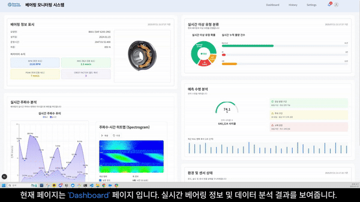
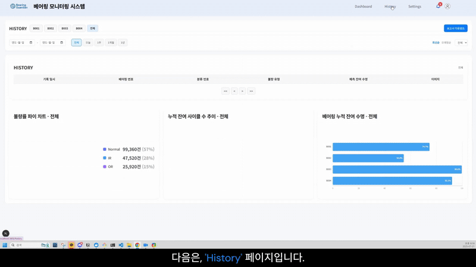
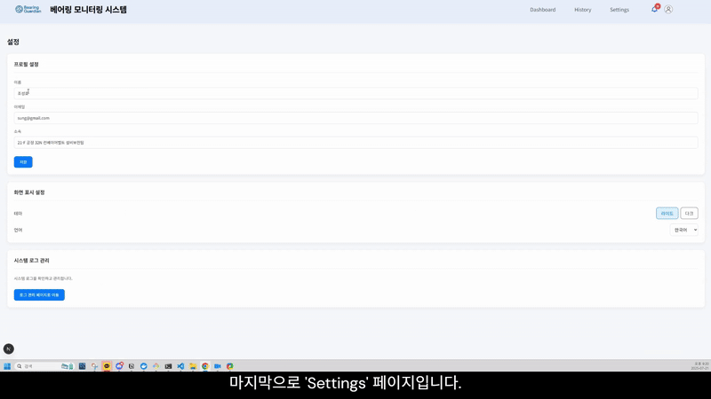

# 'Bearing Guardian' - AI 기반 베어링 모니터링 시스템

<h3>삼성취업아카데미-삼성SDS 빅데이터 분석 심화 프로젝트</h3>
 

# 팀원 소개

| `` | `` | `` | `` |
| :------------------------------------------------------------: | :-------------------------------------------------------------: | :------------------------------------------------------------: | :------------------------------------------------------------: |
|       [조성호 - BE/Data/PM](https://github.com/sungholion)       |         [박정훈 - BE/Data](https://github.com/ezypzylemon)         |         [임정은 - BE/Data](https://github.com/JEONGEUNdd)         |         [허지원 - FE/Data](https://github.com/Heojiwonnn)         |

 

<h1>Tech Stack</h1>

### Infra

  
  
  

### Data Pipeline

  
  
  
  

### Backend

  
  
  
  

### Data Analysis

  
  
  

### FrontEnd

  
  
  
  

### Team Collaboration Tools

    
  
  

 
 
<h1>Architecture</h1>

# 소개

### 🌃 기획 의도

> 기존 베어링 이상 탐지 모니터링 시스템보다 효율적인 서비스를 만들 수 있을까?

모터와 같은 회전하는 부품 사이에서 마찰을 줄여 에너지 손실을 줄여주는 **베어링** 부품은 다양한 산업에 사용됩니다.  
베어링이 마모되어 고장이 난다면, 설비 전체에 영향을 끼칠 수 있기에 미리 베어링의 이상을 감지하는 모니터링 시스템이 필요합니다.  
기존의 베어링 모니터링 시스템도 충분히 효과적이지만, **진동 센서** 기반이라 비싸다는 단점이 있습니다.

이를 해결하기 위해 **음향 센서**를 활용래 더 효율적이고 저렴한 베어링 모니터링 서비스를 만들게 되었습니다.

 

### 서비스 대상

- 고비용의 진동 센서 기반 모니터링 시스템 도입이 부담스러운 중소기업
- 기존 진동 센서 기반 모니터링 시스템 유지 비용이 부담스러운 기업

비용 감소에 초점을 맞춰 기획을 진행하였고, 기존 솔루션보다 정확도를 높이기 위해 노력했습니다.

`  `

# 🎇 서비스 이용 화면

## 1. 대시보드 (Dashboard)

- 베어링 정보 표시: 모델명, 설치일, 하중 등 주요 스펙 및 진동 지표(RPM, RMS 등) 제공
- 실시간 주파수 분석: 주파수-시간 히트맵(Spectrogram)과 트렌드 차트를 통해 고장 징후 감지
- 상태 요약: 고장 유형(Normal, IR, OR 등) 분류 및 실시간 불량 개수 시각화
- 예측 수명 분석 (RUL): 잔여 수명(일/사이클) 예측 및 경고 구간 색상 구분
- 환경 정보 표시: 온도, 습도, 센서 연결 및 모터 구동 상태 모니터링
 
 

   
## 2. 히스토리 (History)

- 예측 이력 테이블: 예측 시각, 고장 유형, 잔여 수명 등의 전체 이력 열람
- 불량률 차트 분석: 고장 분포 시각화(Pie Chart) 및 경고/주의 구간 확인
- 잔여 수명 추이: 시간에 따른 잔여 수명 변화 그래프 제공
- 베어링별 누적 수명 비교: ID별 잔여 수명을 막대그래프로 비교해 이상 베어링 식별 가능
- PDF 자동 생성: 대시보드 분석 내용을 기반으로 실시간 보고서 생성 및 다운로드 가능

 
 

## 3. 설정 (Settings)

- 프로필 설정: 이름, 이메일, 소속 정보 수정 가능
- 화면 표시 설정: 라이트/다크 모드 및 언어(한국어/영어) 선택 가능
- 시스템 로그 관리: 사용자별 시스템 접근 로그 확인 및 관리 화면 이동
 
 

      

# 🔨 사용한 기술

## Kafka

본 프로젝트에서는 실제로 동작하는 베어링 소음 센서 데이터를 흉내내기 위해 베어링 소음 테스트 데이터셋으로 시뮬레이터를 구현하였습니다.
Kafka는 대용량 데이터를 안정적으로 처리할 수 있어, 센서 시뮬레이터에서 발생한 데이터를 Flask 기반 웹 서버로 비동기적으로 전달하는 데 사용되었습니다. 이를 통해 실시간 처리 및 확장성 있는 데이터 흐름을 구축할 수 있었습니다.

- **Producer**: 베어링에서 생성되는 시뮬레이션 데이터를 Kafka 토픽으로 전송합니다. 이 데이터는 베어링의 상태를 나타내는 다양한 센서 값을 포함합니다.
- **Consumer**: Kafka 토픽에서 데이터를 실시간으로 수신하고, WebSocket을 통해 Frontend로 전달합니다.

## Hadoop

대용량의 베어링 센서 데이터를 안정적으로 저장하고 관리하기 위해 Hadoop의 분산 파일 시스템인 HDFS(Hadoop Distributed File System)를 사용합니다.
HDFS는 데이터를 여러 노드에 분산 저장하여 높은 처리량과 데이터 안정성을 보장하며, 이는 장기간의 시계열 데이터를 기반으로 한 모델 학습 및 분석의 기반이 됩니다.

## Hive

HDFS에 저장된 대규모 정형 데이터를 쉽게 질의하고 분석하기 위해 데이터 웨어하우스 시스템인 Hive를 도입했습니다.
HiveSQL이라는 SQL과 유사한 언어를 사용하여 Hadoop 클러스터에 저장된 데이터를 배치 처리하고, 주기적인 리포트 생성 및 통계 분석 작업을 수행합니다.

## Spark

본 프로젝트의 핵심 데이터 처리 엔진으로 Apache Spark를 활용합니다. Spark는 대규모 배치 처리를 모두 지원합니다.
**Spark MLlib & Batch**: HDFS에 축적된 대규모 데이터를 사용하여 머신러닝 모델을 학습하고 평가합니다. 주기적으로 새로운 데이터로 모델을 재학습하여 예측 성능을 지속적으로 개선합니다.

# 도메인 적응 이상 분류 모델

**(ResNet50V2 + LSTM 기반, 2단계 구조)**

센서 기반 음향 데이터를 활용해 생성된 **흑백 스펙트로그램**을 입력으로 받아,
**ResNet50V2 + LSTM 기반의 2단계 분류 모델**로 베어링의 이상 상태를 정밀하게 판별합니다.
각 단계에 **도메인 적응 구조(MCDANN)**를 적용하여,
**환경 간 차이(SNR, 마이크 조건 등)**에도 강건한 분류 성능을 확보했습니다.

---

## 데이터 구성

- **데이터셋**: DCASE Task 2 + SUBF 베어링 이상 데이터
- **입력 형식**: Grayscale 스펙트로그램 → `[x, x, x]` 복제하여 3채널로 확장
- **도메인 구성**:
  - Source: SUBF (통제된 환경)
  - Target: DCASE (실제 환경 기반)

---

## 모델 구조 요약 (2단계 분류)

| 항목        | Stage 1                                    | Stage 2                                        |
| ----------- | ------------------------------------------ | ---------------------------------------------- |
| 입력        | 128×256×1 (grayscale) → 3채널로 확장    | 동일                                           |
| 백본        | ResNet50V2 (pretrained, include_top=False) | 동일                                           |
| 시계열 처리 | Reshape → LSTM(128) → Dropout(0.5)       | 동일                                           |
| Label Head  | Dense(1, sigmoid) → Normal / Abnormal     | Dense(3, softmax) → Normal / IR / OR          |
| Domain Head | GRL → Dense(100) → Dense(2, softmax)     | 동일                                           |
| 손실 함수   | Binary CrossEntropy + Domain CrossEntropy  | Categorical CrossEntropy + Domain CrossEntropy |
| 전이학습    | ResNet50V2 Fine-tuning 가능 (옵션)         | 동일                                           |

---

## 2단계 설계 목적

| 단계    | 설명                                                      |
| ------- | --------------------------------------------------------- |
| Stage 1 | 전체 샘플 대상으로 이상 유무 판단 (Normal vs Abnormal)    |
| Stage 2 | 비정상 샘플만 세부 고장 유형 분류 (IR / OR / Normal 포함) |

---

## 성능 요약 (Test Set 기준)

| 단계    | F1-score (Macro) | F1-score (Weighted) |
| ------- | ---------------- | ------------------- |
| Stage 1 | 0.85             | 0.87                |
| Stage 2 | 0.82             | 0.83                |

---

## 구조 선택 이유

- **Grayscale + 3채널 확장**: ResNet 구조 유지하면서 입력 정보 손실 최소화
- **ResNet50V2**: 고주파 영역의 이상 패턴을 강하게 추출
- **LSTM**: 시간 축의 패턴 보존
- **2단계 구조**: 이상 유무와 고장 유형을 분리하여 정밀도 향상
- **MCDANN(GRL)**: Source/Target 간 환경 차이 극복

---

## 트러블슈팅 이력

- 단일 모델로 학습 시 도메인 차이로 인한 불안정 발생
- → GRL 기반 Domain Head 추가 (MCDANN 도입)
- → 2단계 구조 설계로 이상 유무와 유형 분리 → 예측 정확도 안정화

# 잔여 수명 예측 모델 (CNN-LSTM 기반)

센서 기반 진동 시계열 데이터를 입력으로 받아, CNN-LSTM 회귀 모델을 통해 베어링의 잔여 수명(RUL) 을 수치 예측합니다.
현실 환경을 반영한 3종 노이즈 학습을 통해 강건한 성능을 확보하였습니다.

## 데이터 구성

- 데이터셋: PHM IEEE 2012 Bearing Data
- 형식: 시계열 CSV (수평/수직 가속도)
- 특징: 정상 상태부터 고장까지 포함된 run-to-failure 데이터

## 모델 구조 요약

| 항목                  | 내용                                                                               |
| --------------------- | ---------------------------------------------------------------------------------- |
| **입력**        | RMS 기반 시계열 (128 × 2)                                                         |
| **구조**        | `Conv1D(64, kernel=5)` → `Dropout(0.2)` → `LSTM(64)` → `Dense(32 → 1)` |
| **손실 함수**   | Huber Loss                                                                         |
| **노이즈 반영** | 60Hz 진동, 임펄스, Gaussian (SNR=15) → 학습 데이터 30% 적용                       |
| **학습 설정**   | Epoch 50, Batch size 16, EarlyStopping 적용                                        |

## 성능 요약 (Test Set)

| MAE  | RMSE | R²  |
| ---- | ---- | ---- |
| 0.40 | 2.03 | 0.83 |

## 최종 모델 선정 이유

- Conv1D: 고장 징후로 나타나는 국소적 진폭 변화 감지에 효과적
- LSTM: 열화 패턴의 시간적 흐름 학습에 강점
- 경량 구조: 단일 LSTM 대비 입력 전처리 부담 감소, 빠른 학습 수렴

## 트러블슈팅: 전이학습 및 양상불 시도

NASA 기반 모델 전이 및 양상불 적용 시, 도메인/스케일 불일치로 학습 불안정

- → **PHM 데이터 전용 CNN-LSTM 구조로 재설계**
- → 실제 수집 환경 반영 + 노이즈 학습을 통해 **안정적 수렴 및 일반화 성능 확보**
